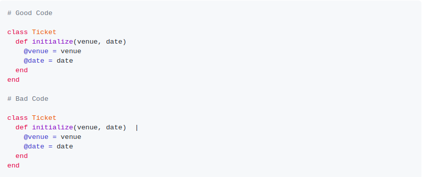
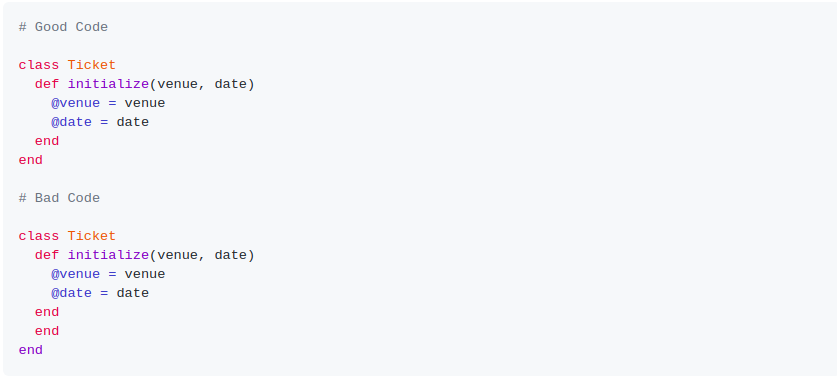
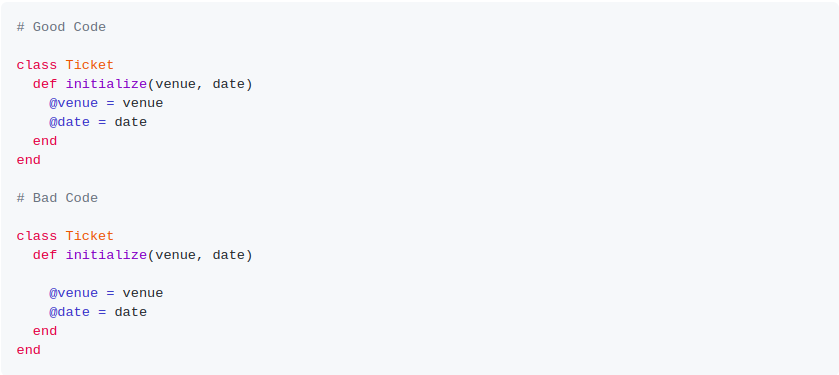
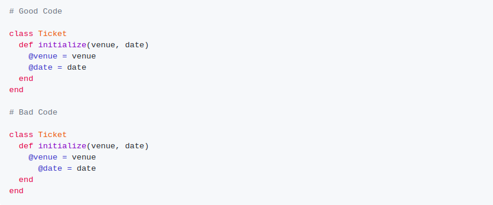

# ruby_capstone- linters for Ruby

Its a customised linter for ruby.The whole idea of writing code to check another code is intriguing at the same time cognitively demanding. Building Linters for Ruby, the project provides feedback about errors or warning in code. The project was built completely with Ruby following all possible best practices. Rubocop was used as a code-linter alongside Gitflow to ensure I maintain good coding standards.

## About the Customized Linter

It checks following style errors:
trailing spaces
open ends
suggestion of good coding practices such as use of 'each', 'until' over 'for'
proper indentation
checks for empty lines at the beginning

## Getting Started

To get a local copy of the repository please run the following commands on your terminal:

$ cd <folder>
  
  $ git clone https://github.com/vidhishweta01/ruby-capstone.git
  
 ## To check for errors on a file:
 
 $ bin/main filename.rb
 
 ## Trailing Spaces
 
 
 
 
 ## Missing Unexpeted end
 
 
 
 
 ## Empty Line error
 
 
 
 
 ## Indentation Error
 
 

## Built with

Ruby

## Authors ��

### Shweta Srivastava

_[Github](https://github.com/vidhishweta01)

_[LinkedIn](http://linkedin.com/in/shweta-s-15a57070)

## Show your support ⭐️⭐️

Give a star if you like this project!

## License ��

This project is [MIT](https://www.mit.edu/~amini/LICENSE.md) licensed.

